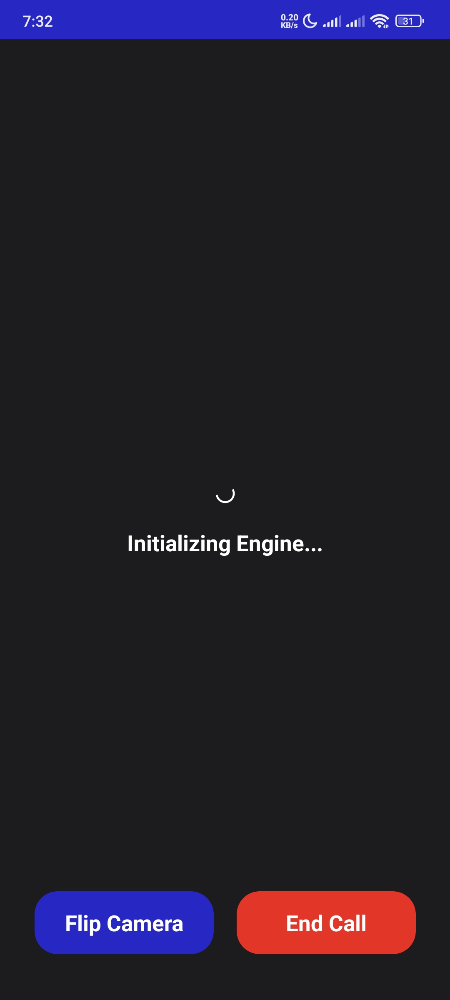
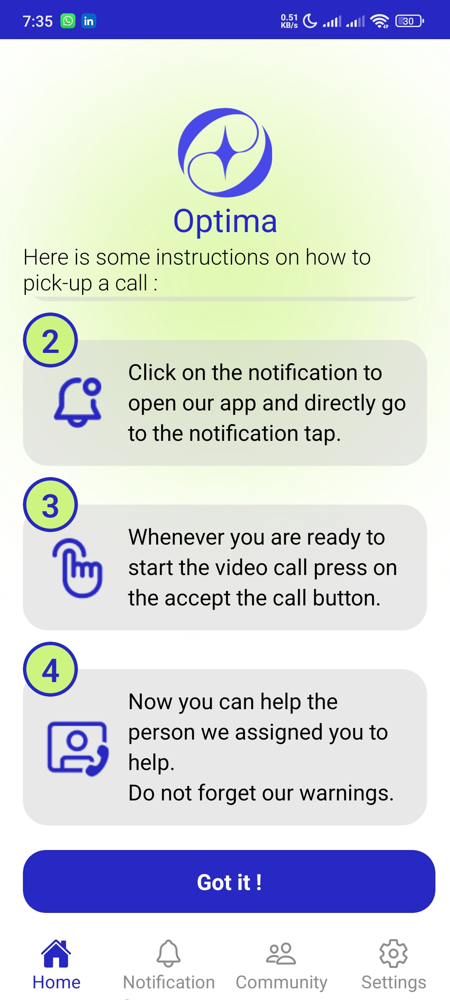

# Optima-ReactNative

[](https://reactnative.dev/) [](https://expo.dev/) [](LICENSE)

## Overview

**Optima** is an innovative, accessibility-focused mobile application designed to connect visually impaired users (Seekers) with volunteers (Helpers) for real-time assistance. Leveraging AI, voice control, and video communication, Optima empowers independence and fosters a supportive community.

---

## Features

### For Seekers (Visually Impaired Users)
- **My Vision**: AI-powered camera assistant for describing surroundings using Google Generative AI and speech synthesis.
- **Support**: Instantly connect with friends or global volunteers for live help via video/audio calls.
- **Call Volunteer**: One-tap access to a global pool of helpers for urgent assistance.
- **Voice Control**: Full app navigation and actions via voice commands.
- **My People**: Manage trusted contacts and friends.
- **Accessibility**: Haptic feedback, speech guidance, and gesture-based navigation throughout the app.

### For Helpers (Volunteers)
- **Home Dashboard**: Overview of pending help requests and personal stats.
- **Notifications**: Real-time alerts when someone needs help.
- **Community**: Access to news, articles, and community events related to accessibility and volunteering.
- **Call Handling**: Accept and manage live support calls from Seekers.

### General
- **Onboarding**: Guided onboarding for new users.
- **Authentication**: Secure login, signup, and password recovery.
- **Multi-platform**: Runs on Android, iOS, and web (via Expo).

---

## Screenshots

> All available screenshots from the `/screenshots` directory are shown below.

<table>
  <tr>
  <td align="center"><br><sub>Screenshot_2025-08-04-19-31-27-931</sub></td>
    <td align="center"><br><sub>Screenshot_2025-08-04-19-31-34-389</sub></td>
    <td align="center"><br><sub>Screenshot_2025-08-04-19-31-32-306</sub></td>
  </tr>
  <tr>
    <td align="center"><br><sub>Screenshot_2025-08-04-19-31-36-220</sub></td>
    <td align="center"><br><sub>Screenshot_2025-08-04-19-31-44-415</sub></td>
    <td align="center"><br><sub>Screenshot_2025-08-04-19-31-39-410</sub></td>
  </tr>
  <tr>
    <td align="center"><br><sub>Screenshot_2025-08-04-19-32-03-366</sub></td>
    <td align="center"><br><sub>Screenshot_2025-08-04-19-31-52-677</sub></td>
    <td align="center"><br><sub>Screenshot_2025-08-04-19-31-47-360</sub></td>
  </tr>
  <tr>
    <td align="center"><br><sub>Screenshot_2025-08-04-19-32-11-370</sub></td>
    <td align="center"><br><sub>Screenshot_2025-08-04-19-32-24-444</sub></td>
    <td align="center"><br><sub>Screenshot_2025-08-04-19-32-06-424</sub></td>
  </tr>
  <tr>
    <td align="center"><br><sub>Screenshot_2025-08-04-19-34-19-949</sub></td>
    <td align="center"><br><sub>Screenshot_2025-08-04-19-33-32-976</sub></td>
    <td align="center"><br><sub>Screenshot_2025-08-04-19-33-21-999</sub></td>
  </tr>
  <tr>
    <td align="center"><br><sub>Screenshot_2025-08-04-19-34-39-988</sub></td>
    <td align="center"><br><sub>Screenshot_2025-08-04-19-34-33-439</sub></td>
    <td align="center"><br><sub>Screenshot_2025-08-04-19-34-29-959</sub></td>
  </tr>
  <tr>
    <td align="center"><br><sub>Screenshot_2025-08-04-19-36-06-709</sub></td>
    <td align="center"><br><sub>Screenshot_2025-08-04-19-35-56-416</sub></td>
    <td align="center"><br><sub>Screenshot_2025-08-04-19-35-54-601</sub></td>
  </tr>
  <tr>
    <td align="center"><br><sub>Screenshot_2025-08-04-19-35-27-418</sub></td>
    <td align="center"><br><sub>Screenshot_2025-08-04-19-35-23-795</sub></td>
    <td align="center"><br><sub>Screenshot_2025-08-04-19-35-19-144</sub></td>
  </tr>
  <tr>
    <td align="center"><br><sub>Screenshot_2025-08-04-19-35-06-604</sub></td>
    <td align="center"><br><sub>Screenshot_2025-08-04-19-34-46-775</sub></td>
    <td align="center"><br><sub>Screenshot_2025-08-04-19-34-42-856</sub></td>
  </tr>
  <tr>
    <td align="center"><br><sub>Screenshot_2025-08-04-19-37-29-278</sub></td>
    <td align="center"><br><sub>Screenshot_2025-08-04-19-37-20-280</sub></td>
    <td align="center"><br><sub>Screenshot_2025-08-04-19-36-33-036</sub></td>
  </tr>
</table>

---

## Getting Started

### Prerequisites
- [Node.js](https://nodejs.org/) (v18+ recommended)
- [Expo CLI](https://docs.expo.dev/get-started/installation/)
- [Yarn](https://yarnpkg.com/) or npm

### Installation

```bash
# Clone the repository
$ git clone https://github.com/Optima-Dev/Optima-ReactNative
$ cd Optima-ReactNative

# Install dependencies
$ npm install
# or
yarn install
```

### Running the App

```bash
# Start the Expo development server
$ npm start
# or
yarn start
```

- For Android: `npm run android`
- For iOS: `npm run ios`
- For Web: `npm run web`

---

## Project Structure

```
Optima-ReactNative/
├── App.jsx                # Main app entry point
├── index.js               # Expo entry
├── components/            # Reusable UI components
├── screens/               # App screens (Seeker, Helper, Auth, etc.)
├── store/                 # Context providers and state management
├── util/                  # Utility functions and API calls
├── assets/                # Images, icons, and static assets
├── constants/             # App-wide constants (colors, etc.)
├── hooks/                 # Custom React hooks
├── plugins/               # Native/Expo plugins
├── app.json               # Expo app configuration
├── package.json           # Project metadata and dependencies
└── ...
```

---

## Usage

1. **Register** as a Seeker or Helper.
2. **Seekers** can use voice or gestures to navigate, request help, or use AI vision.
3. **Helpers** receive notifications and can join calls to assist Seekers.
4. **Community** tab provides news and resources for all users.

---

## Technologies Used
- **React Native** (0.79+)
- **Expo** (53+)
- **Google Generative AI** (for vision features)
- **Agora** (for real-time video/audio calls)
- **React Navigation**
- **AsyncStorage**
- **Voice Recognition & Speech Synthesis**
- **Haptics & Accessibility APIs**

---

## Contributing

Contributions are welcome! Please open issues and submit pull requests for improvements or bug fixes.

1. Fork the repository
2. Create your feature branch (`git checkout -b feature/YourFeature`)
3. Commit your changes (`git commit -am 'Add new feature'`)
4. Push to the branch (`git push origin feature/YourFeature`)
5. Open a pull request

---

## License

This project is licensed under the MIT License. See the [LICENSE](LICENSE) file for details.

---

## Contact

Maintainer: [7atoom](mailto:ahmed.hatem.dev@gmail.com)

For support or business inquiries, please contact the maintainer or open an issue on GitHub.
